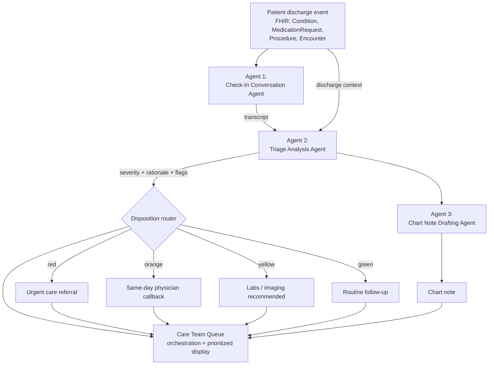

# Design Document: Post-Discharge Triage Agent

## 1. Problem & motivation

Post-hospitalization and post-procedural readmissions are one of the more
expensive, penalized problems in U.S. healthcare (CMS's Hospital Readmissions
Reduction Program directly ties reimbursement to it). The early warning signs
— worsening symptoms, uncontrolled pain, medication confusion — typically
surface in the days right after discharge, in a phone check-in that may or
may not happen consistently, get triaged by whoever happens to answer, and
get documented (if at all) after the fact.

This project is an agentic pipeline that standardizes that check-in: it
conducts (or ingests) a post-discharge conversation, reasons about it against
the *specific* patient's discharge context, and routes the outcome to one of
four dispositions with a clinician-reviewable rationale and a drafted chart
note — closing the loop from "we called the patient" to "the right person
knows to act."

It's designed as a natural extension of Abridge's existing product line
(ambient conversation → structured clinical output), just applied to a
post-visit phone check-in rather than the exam-room encounter Abridge
already documents.

## 2. Agentic workflow

Three distinct agents, one orchestration layer:

1. **Check-In Conversation Agent** — conducts/produces the post-discharge
   conversation.
2. **Triage Analysis Agent** — reasons about that conversation against the
   patient's specific discharge context and decides a disposition.
3. **Chart Note Drafting Agent** — turns the call + decision into a
   clinician-reviewable note.

The **Care Team Queue** isn't a fourth agent — it's the orchestration/display
layer that sequences the three agents per patient and ranks the resulting
queue by severity, so the highest-acuity patients surface first for the
human care team.

## 3. Agent-by-agent breakdown

### Agent 1 — Check-In Conversation Agent

**Purpose:** produce the transcript of a post-discharge check-in, tailored
to the patient's actual discharge diagnosis, comorbidities, and medications
so the questions asked are clinically relevant (e.g. asking a recent
COVID/pneumonia patient specifically about breathing, not a generic "how are
you feeling" script).

| | |
|---|---|
| **Inputs** | `patient_context` (FHIR Patient + longitudinal condition/medication summary), `encounter_fhir` (discharge Encounter + related Condition/Procedure/MedicationRequest resources) |
| **Output** | Speaker-labeled transcript (`AGENT:` / `PT:` / `FAMILY:`) |
| **Current implementation** | Hand-written, fixed per demo patient — a stand-in for either a real telephony transcript or an LLM-conducted conversation |
| **Target implementation** | Claude call prompted with the patient's discharge context, generating (or, in a live system, actually conducting via voice) a check-in conversation that asks condition-specific questions |

### Agent 2 — Triage Analysis Agent

**Purpose:** the clinical reasoning core. Reads the check-in transcript
alongside the patient's discharge context and decides which of four
outcomes fits, with a rationale a clinician can quickly verify or overrule.

| | |
|---|---|
| **Inputs** | Transcript from Agent 1, `patient_context`, `encounter_fhir` |
| **Output** | `{ severity, label, rationale: [...], flags: [...] }` |
| **Current implementation** | Rule-based keyword scorer (`analyzeTranscript()` in `index.html`) — matches patient statements against fixed red/orange/yellow phrase lists per severity tier |
| **Target implementation** | Claude call with a structured-output prompt, given the same inputs, reasoning about severity in context rather than matching fixed phrases — critically, this is where an LLM earns its keep over keyword matching: understanding negation ("no chest pain" vs. reporting chest pain), reading symptom severity relative to the patient's specific history, and weighing multiple findings together rather than triggering on any single keyword hit |

**Known limitation of the current stub** (worth stating plainly, since it's
a real gap the target implementation solves): the keyword matcher had to be
hand-tuned to avoid false positives — e.g. it originally scored the agent's
own questions ("any chest pain?") as a positive finding regardless of the
patient's answer, and had to be restricted to only the patient/family half of
the conversation. Even then, literal negations inside a patient's own
sentence (e.g. "no, haven't needed that") require careful phrasing to avoid
tripping the matcher. This is exactly the class of problem real language
understanding solves and rule-based matching cannot.

### Agent 3 — Chart Note Drafting Agent

**Purpose:** produce a concise, clinician-reviewable note documenting the
check-in, the disposition, and the reasoning behind it — for the chart and
for the human recipient of the Care Team Queue alert.

| | |
|---|---|
| **Inputs** | Transcript, disposition + rationale from Agent 2, patient demographics |
| **Output** | Structured note text (Subjective / Assessment / Plan) |
| **Current implementation** | String template (`draftNote()`) assembling the above into fixed note sections |
| **Target implementation** | Claude call drafting genuine prose from the transcript rather than concatenating template strings — closer to how Abridge's existing note-generation product already works, just pointed at this new input |

### Orchestration layer — Care Team Queue

**Purpose:** run all three agents per patient, rank the resulting patient
list by severity (red → orange → yellow → green) so the care team's
attention goes to the highest-acuity cases first, and render the
transcript/decision/note for human review per patient.

Currently implemented client-side in `index.html`; in a production version
this becomes the backend service described below, running the three agents
server-side and persisting results rather than recomputing them in the
browser on every page load.

## 4. Disposition taxonomy

| Severity | Label | Meaning | Example from demo |
|---|---|---|---|
| 🔴 Red | Urgent care referral | Acute red-flag symptoms; do not wait for scheduled follow-up | Ariane R. — worsening dyspnea + possible cyanosis after pneumonia/hypoxemia admission |
| 🟠 Orange | Physician callback today | Moderate concern not yet emergent, but shouldn't wait for the next scheduled visit | Latoyia W. — new ankle swelling + rising glucose in a CKD/cardiac patient; Monica H. — pain not controlled by current regimen |
| 🟡 Yellow | Labs / imaging recommended | Symptoms consistent with the underlying condition, worth confirming with objective data, no acute concern | Dick L. — mild residual fatigue and family-reported pallor after sepsis recovery, anemia/glucose recheck appropriate |
| 🟢 Green | Routine follow-up | No red-flag or moderate-concern findings; recovery on expected trajectory | Traci W. — steady glucose control, resolved symptoms after diabetes stabilization admission |

## 5. Data grounding

Every demo patient's age, gender, discharge diagnosis, comorbidities, and
medications are pulled directly from real records in the
`synthetic-ambient-fhir-25` dataset's `patient_context` and `encounter_fhir`
FHIR resources — nothing about the clinical background is invented. Only the
check-in transcripts (Agent 1's current stand-in) are hand-written for this
demo, clearly labeled as such in the UI.

## 6. Current vs. target implementation (engineering roadmap)

| Component | Now | Next |
|---|---|---|
| Agent 1 (conversation) | Hand-written transcripts | Claude-generated transcripts from discharge context |
| Agent 2 (triage) | Keyword rule engine | Claude structured-output call |
| Agent 3 (notes) | String template | Claude drafting call |
| Hosting | Single static HTML file, all logic client-side | Small backend (Flask/FastAPI or Express) holding the Anthropic API key server-side; frontend calls `/api/triage` and `/api/draft-note` instead of running local JS functions |
| Data source | Fixed 5-patient demo array in `index.html` | Full 25-encounter dataset, or a real EHR feed via FHIR |

The backend split (server holds the API key, frontend never sees it) is
required before any real Claude call — see `README.md` for the security
rationale and suggested endpoint shapes.

## 7. Possible extensions (not built)

- **Closed-loop referral generation:** an urgent/orange disposition also
  drafts a referral packet with clinical justification, rather than just
  alerting a human (aligns with Abridge's current prior-authorization/payer
  workflow expansion).
- **Real EHR grounding:** Epic's open FHIR sandbox (fhir.epic.com) can be
  read from for real `ServiceRequest`/`MedicationRequest` data, though it's
  read-only and limited to a small fixed set of generic test patients — more
  useful as a "we're FHIR-R4-native, here's proof" talking point than a
  fully wired demo path within a one-day build.
