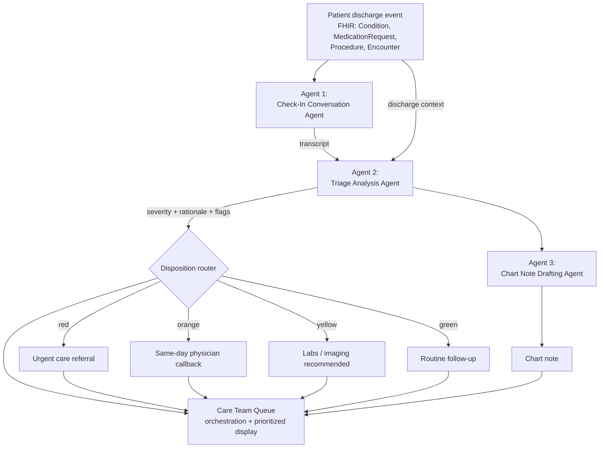

# Design Document: Post-Discharge Triage Agent

## 1. Problem & motivation

Post-hospitalization and post-procedural readmissions are one of the more
expensive, penalized problems in U.S. healthcare (CMS's Hospital Readmissions
Reduction Program directly ties reimbursement to it). The early warning signs
— worsening symptoms, uncontrolled pain, medication confusion — typically
surface in the days right after discharge, in a phone check-in that may or
may not happen consistently, get triaged by whoever happens to answer, and
get documented (if at all) after the fact.

This project is an agentic pipeline that standardizes that check-in: it
conducts (or ingests) a post-discharge conversation, reasons about it against
the *specific* patient's discharge context, and routes the outcome to one of
six dispositions (see §4 — this started as a 4-tier red/orange/yellow/green
design and was later expanded) with a clinician-reviewable rationale and a
drafted chart note — closing the loop from "we called the patient" to "the
right person knows to act."

**Note:** this document describes the original design. Two things have since
diverged from it in practice — worth reading alongside `README.md` and
`CLAUDE.md` for the current state: (1) the disposition taxonomy is now 6-way,
not 4-tier (§4 below is updated to match); (2) a second, parallel demo track
was added — `demo.html`/`index.html`, grounded in a synthetic GI-procedure
dataset instead of `synthetic-ambient-fhir-25`, with `index.html` placing a
real live ElevenLabs voice call in the browser rather than Agent 1 being a
Claude call at all. That track isn't reflected in the agentic-workflow
diagram below, which still describes the original single-track design.

It's designed as a natural extension of Abridge's existing product line
(ambient conversation → structured clinical output), just applied to a
post-visit phone check-in rather than the exam-room encounter Abridge
already documents.

## 2. Agentic workflow

Three distinct agents, one orchestration layer:

1. **Check-In Conversation Agent** — conducts/produces the post-discharge
   conversation.
2. **Triage Analysis Agent** — reasons about that conversation against the
   patient's specific discharge context and decides a disposition.
3. **Chart Note Drafting Agent** — turns the call + decision into a
   clinician-reviewable note.

The **Care Team Queue** isn't a fourth agent — it's the orchestration/display
layer that sequences the three agents per patient and ranks the resulting
queue by severity, so the highest-acuity patients surface first for the
human care team.

## 3. Agent-by-agent breakdown

### Agent 1 — Check-In Conversation Agent

**Purpose:** produce the transcript of a post-discharge check-in, tailored
to the patient's actual discharge diagnosis, comorbidities, and medications
so the questions asked are clinically relevant (e.g. asking a recent
COVID/pneumonia patient specifically about breathing, not a generic "how are
you feeling" script).

| | |
|---|---|
| **Inputs** | `patient_context` (FHIR Patient + longitudinal condition/medication summary), `encounter_fhir` (discharge Encounter + related Condition/Procedure/MedicationRequest resources) |
| **Output** | Speaker-labeled transcript (`AGENT:` / `PT:` / `FAMILY:`) |
| **Current implementation** | Hand-written, fixed per demo patient — a stand-in for either a real telephony transcript or an LLM-conducted conversation |
| **Target implementation** | Claude call prompted with the patient's discharge context, generating (or, in a live system, actually conducting via voice) a check-in conversation that asks condition-specific questions |

### Agent 2 — Triage Analysis Agent

**Purpose:** the clinical reasoning core. Reads the check-in transcript
alongside the patient's discharge context and decides which of four
outcomes fits, with a rationale a clinician can quickly verify or overrule.

| | |
|---|---|
| **Inputs** | Transcript from Agent 1, `patient_context`, `encounter_fhir` |
| **Output** | `{ severity, label, rationale: [...], flags: [...] }` |
| **Current implementation** | Rule-based keyword scorer (`analyzeTranscript()` in `index.html`) — matches patient statements against fixed red/orange/yellow phrase lists per severity tier |
| **Target implementation** | Claude call with a structured-output prompt, given the same inputs, reasoning about severity in context rather than matching fixed phrases — critically, this is where an LLM earns its keep over keyword matching: understanding negation ("no chest pain" vs. reporting chest pain), reading symptom severity relative to the patient's specific history, and weighing multiple findings together rather than triggering on any single keyword hit |

**Known limitation of the current stub** (worth stating plainly, since it's
a real gap the target implementation solves): the keyword matcher had to be
hand-tuned to avoid false positives — e.g. it originally scored the agent's
own questions ("any chest pain?") as a positive finding regardless of the
patient's answer, and had to be restricted to only the patient/family half of
the conversation. Even then, literal negations inside a patient's own
sentence (e.g. "no, haven't needed that") require careful phrasing to avoid
tripping the matcher. This is exactly the class of problem real language
understanding solves and rule-based matching cannot.

### Agent 3 — Chart Note Drafting Agent

**Purpose:** produce a concise, clinician-reviewable note documenting the
check-in, the disposition, and the reasoning behind it — for the chart and
for the human recipient of the Care Team Queue alert.

| | |
|---|---|
| **Inputs** | Transcript, disposition + rationale from Agent 2, patient demographics |
| **Output** | Structured note text (Subjective / Assessment / Plan) |
| **Current implementation** | String template (`draftNote()`) assembling the above into fixed note sections |
| **Target implementation** | Claude call drafting genuine prose from the transcript rather than concatenating template strings — closer to how Abridge's existing note-generation product already works, just pointed at this new input |

### Orchestration layer — Care Team Queue

**Purpose:** run all three agents per patient, rank the resulting patient
list by severity (red → orange → yellow → green) so the care team's
attention goes to the highest-acuity cases first, and render the
transcript/decision/note for human review per patient.

Currently implemented client-side in `index.html`; in a production version
this becomes the backend service described below, running the three agents
server-side and persisting results rather than recomputing them in the
browser on every page load.

## 4. Disposition taxonomy (current — 6-way, supersedes the original 4-tier design)

| Disposition | Meaning | Example |
|---|---|---|
| `emergency_department` | Acute/emergent findings with an objective severe-distress feature (can't speak/breathe, chest pain, fainting, confusion, cyanosis, uncontrolled bleeding) — go now, don't wait for scheduled care | Helen R. (GI track) — post-polypectomy bleeding with orthostatic dizziness |
| `urgent_care_same_day` | Moderate-to-serious concern needing same-day in-person evaluation, not immediately life-threatening | Miguel F. (GI track) — fever + productive cough + exertional dyspnea after EGD, no severe-distress features |
| `clinician_callback_required` | **Not a severity tier** — a guardrail for when the AI can't responsibly assess the patient at all: insufficient information, or an uncooperative/hostile patient. Ranked above the "confirmed stable" tiers below since an unresolved unknown is riskier than a case with enough signal to conclude things are fine | Harriet B. (GI track) — dementia patient unable to reliably answer; Jordan K. (GI track) — patient refuses to engage |
| `clinic_follow_up` | Scheduling ticket for a close (within-days) clinic visit — more than routine, less than same-day urgent | Robert N. (GI track) — overdue pathology-result callback |
| `labs_imaging_needed` | Stable, symptoms consistent with the known condition, but objective data would confirm the recovery trajectory | Deshawn W. (GI track) — stable post-ERCP, overdue liver labs |
| `routine_follow_up` | Recovering as expected; continue the existing plan, no new action | Yolanda R. (GI track) — expected post-colonoscopy course |

The original 4-tier design (kept here for history): 🔴 Red (urgent care
referral) → 🟠 Orange (physician callback today) → 🟡 Yellow (labs/imaging
recommended) → 🟢 Green (routine follow-up), demonstrated against the 5
`synthetic-ambient-fhir-25` patients (Ariane R., Latoyia W., Monica H.,
Traci W., Dick L.). `services/triage_service.py`'s `SEVERITY_ORDER` still
maps these old values to the new taxonomy's ranks for backward
compatibility.

## 5. Data grounding

Every demo patient's age, gender, discharge diagnosis, comorbidities, and
medications are pulled directly from real records in the
`synthetic-ambient-fhir-25` dataset's `patient_context` and `encounter_fhir`
FHIR resources — nothing about the clinical background is invented. Only the
check-in transcripts (Agent 1's current stand-in) are hand-written for this
demo, clearly labeled as such in the UI.

## 6. Current vs. target implementation (engineering roadmap)

| Component | Original plan | Current state |
|---|---|---|
| Agent 1 (conversation) | Hand-written transcripts → Claude-generated transcripts | DB track: real ElevenLabs/Twilio call or simulated canned transcript. GI track (`index.html`): real live ElevenLabs voice call in the browser via `@elevenlabs/client`. Claude never generates the conversation itself in either track. |
| Agent 2 (triage) | Keyword rule engine → Claude structured-output call | **Done** — Claude Sonnet 5 tool-use call (`analyze_transcript_with_claude()`), live in both tracks; old keyword matcher kept as fallback/reference only |
| Agent 3 (notes) | String template → Claude drafting call | **Done for the GI track** (`draft_note_with_claude()`, Claude Haiku). DB track's call-completion pipeline (`services/pipeline_service.py`) still calls the old string-template stub — remaining gap |
| Hosting | Single static HTML file, all logic client-side → small backend holding the API key server-side | **Done** — Flask + SQLAlchemy backend (`app.py`/`routes/`/`services/`); both `demo.html` (no backend needed) and `index.html` (calls the backend for live GI-track analysis) still ship as self-contained frontends |
| Data source | Fixed 5-patient demo array → full 25-encounter dataset or real EHR feed | 5-patient DB track still uses `synthetic-ambient-fhir-25`; a second 7-patient GI track was added using a separate synthetic GI-procedure dataset (`synthetic-gi-data/`), not yet a real EHR feed |

The backend split (server holds the API key, frontend never sees it) is
required before any real Claude call — see `README.md` for the security
rationale and endpoint shapes, and `CLAUDE.md` for the specific remaining
wiring gap (`pipeline_service.finalize_call()` not yet using the real
Agent 2/3 calls).

## 7. Extensions built since this design doc

- **A second, GI-procedure-focused demo track** (`demo.html`/`index.html`,
  `services/gi_live_service.py`, `gi_context.py`, `gi_demo_patients.py`,
  `synthetic-gi-data/`) — 7 patients, one per disposition tier plus a
  guardrail test case, reusing the same Agent 2/3 prompts against a
  different clinical dataset and a real live voice call instead of a
  Claude-generated one.
- **A guardrail disposition**, `clinician_callback_required`, for when the
  AI shouldn't force a clinical guess at all (insufficient information, or
  an uncooperative/adversarial patient) — not in the original 4-tier design.

## 8. Possible extensions (not built)

- **Closed-loop referral generation:** an urgent disposition also drafts a
  referral packet with clinical justification, rather than just alerting a
  human (aligns with Abridge's current prior-authorization/payer workflow
  expansion).
- **Real EHR grounding:** Epic's open FHIR sandbox (fhir.epic.com) can be
  read from for real `ServiceRequest`/`MedicationRequest` data, though it's
  read-only and limited to a small fixed set of generic test patients — more
  useful as a "we're FHIR-R4-native, here's proof" talking point than a
  fully wired demo path within a one-day build.
- **Close the `pipeline_service.py` wiring gap** so the DB track's live/
  simulated voice calls get the same real Agent 2/3 reasoning the direct
  `/api/triage`/`/api/draft-note` endpoints already do.
